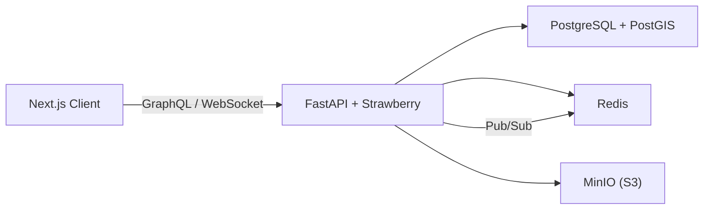

# MatchFit

**Find your sports companion — swipe, match, play**


MatchFit is a social platform for finding sports partners. Users create profiles with their fitness goals and favorite sports, discover nearby people through a swipe-based interface, and coordinate activities via real-time chat — all powered by geospatial queries for location-aware matching.

## Architecture



## Features

- **Swipe Matching** — Tinder-style card swiping to find sports partners, with mutual match detection
- **Real-time Chat** — WebSocket-powered messaging with GraphQL subscriptions and Redis pub/sub
- **Sports Events** — Create and join events with location, difficulty, and participant limits
- **Geospatial Discovery** — PostGIS-powered proximity search for events and people
- **User Profiles** — Rich profiles with sports preferences, goals, languages, and avatar uploads
- **Google Maps Integration** — Interactive maps for event locations and nearby activity discovery
- **Notifications** — Real-time notification system for matches, messages, and event updates
- **Google OAuth** — Seamless authentication alongside email/password signup

## Tech Stack

| Layer | Technologies |
|-------|-------------|
| **Frontend** | Next.js 16, React 19, TypeScript, Apollo Client, Zustand, Tailwind CSS, shadcn/ui, Google Maps API |
| **Backend** | FastAPI, Strawberry GraphQL, SQLAlchemy 2.0 (async), Alembic, Pydantic |
| **Database** | PostgreSQL 16 + PostGIS 3.4, Redis |
| **Storage** | MinIO (S3-compatible) |
| **Auth** | JWT (access + refresh tokens), Google OAuth 2.0, bcrypt |
| **DevOps** | Docker, Docker Compose |

## Screenshots

> _Screenshots coming soon_

## Getting Started

### Prerequisites

- Python 3.13+ with [uv](https://docs.astral.sh/uv/)
- Node.js 18+
- Docker & Docker Compose

### 1. Start infrastructure

```bash
docker compose up -d
```

This starts PostgreSQL (with PostGIS), Redis, and MinIO.

### 2. Backend setup

```bash
cd backend
cp .env.example .env
# Fill in your secrets in .env

uv sync
uv run migrate upgrade head
uv run server --reload
```

The GraphQL API will be available at `http://localhost:8000/graphql`.

### 3. Frontend setup

```bash
cd frontend
cp .env.example .env
# Fill in your API URL and Google Maps key

npm install
npm run dev
```

The app will be available at `http://localhost:3000`.

## API Overview

The API is a single GraphQL endpoint supporting queries, mutations, and subscriptions.

**Key operations:**

| Domain | Operations |
|--------|-----------|
| **Auth** | `register`, `login`, `googleAuth`, `refreshTokens` |
| **Profiles** | `updateProfile`, `uploadAvatar`, `getProfile`, `getNearbyProfiles` |
| **Matching** | `createMatch` (swipe), `getMatches` |
| **Events** | `createEvent`, `joinEvent`, `getEvents`, `getNearbyEvents` |
| **Chat** | `createChat`, `sendMessage`, `onNewMessage` (subscription) |
| **Notifications** | `getNotifications`, `markAsRead`, `onNewNotification` (subscription) |

## Project Structure

```
matchfit/
├── docker-compose.yml         # Local dev infrastructure
├── backend/
│   ├── app/
│   │   ├── config/            # Pydantic settings
│   │   ├── models/            # SQLAlchemy ORM models
│   │   ├── repositories/      # Data access layer
│   │   ├── services/          # Business logic
│   │   ├── graphql/
│   │   │   ├── mutations/     # Create/update operations
│   │   │   ├── queries/       # Read operations
│   │   │   ├── subscriptions/ # WebSocket real-time
│   │   │   ├── types/         # GraphQL output types
│   │   │   └── schema.py      # Root schema
│   │   └── utils/             # Auth, geo, storage helpers
│   ├── alembic/               # Database migrations
│   ├── Dockerfile
│   └── pyproject.toml
└── frontend/
    ├── src/
    │   ├── app/               # Next.js App Router pages
    │   ├── features/          # Feature modules (auth, chat, events, etc.)
    │   └── shared/            # Apollo client, stores, hooks, UI
    ├── public/                # Static assets & icons
    └── package.json
```